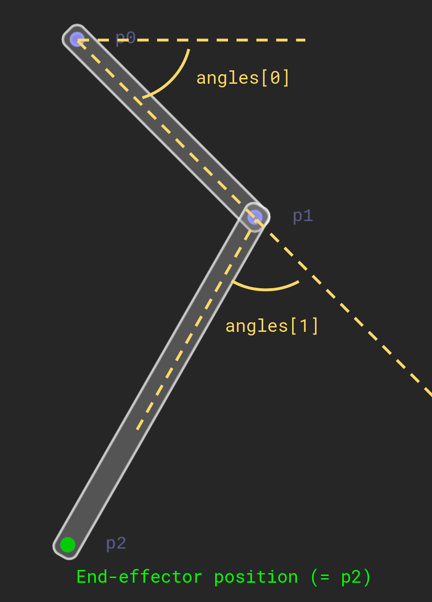

### Assignment 1 

# Inverse Kinematics

For a more readable version of this document, see [Readme.pdf](Readme.pdf).

In this assignment you will implement forward and inverse kinematics of a two-bar linkage. 

## 1 - Forward Kinematics

**Code:** File `src/kinematics/ForwardKinematics.h`, function `forwardKinematics(...)`.

**Task**: Implement forward kinematics for the linkage above by computing the coordinates of points `p0`, `p1` and `p2` given angles `angles`.

**Details:** The function `forwardKinematics` returns an array of size 3 containg the positions of the 3 points that define the state of the linkage, `p0`, `p1` and `p2`. The angles of the linkage are defined in the figure above.

**Test:** Compile and run `src/test-a1/test.cpp`.  Test 1 should pass.

Compile and run `src/app/linkage-app.cpp`. You can change the angles with the sliders or by left-clicking in the left half of the app.

## 2 - Derivatives of Forward Kinematics

We want to solve the inverse kinematics using an optimization-based approach. For this, we will need derivatives of thee forward kinematics, or in other words, how the end-effector coordinates change when we change the angles.

**Code:** File `src/kinematics/ForwardKinematics.h`, functions `dendEffector_dangles(...)` and `ddendEffector_ddangles(...)`.

**Task:** Implement the 1st and 2nd derivative (Jacobian and derivative of Jacobian) of the end-effector position with respect to the angles. 

**Details:** Implementing these functions will help us later setup inverse kinematics. 

**Test:** Compile and run `src/test-a1/test.cpp`.  Test 2 and 3 should pass.

## 3 - Inverse Kinematics

Now we are ready to solve inverse kinematics. We want to construct an objective function that describes our goal: Reach a target position (`target`) with the end-effector (`endEffectorPosition(...)`).

**Code:** File `src/kinematics/InverseKinematics.h`.

**Tasks:**

1. Implement the objective function 
   $$
   f(x) = \frac{1}{2}(e(x)-x_t)^T(e(x)-x_t)
   $$
   where $x$ are the angles and $e(x)$ returns the position of the end-effector.
   **Code:** `InverseKinematics::evaluate(x)`. `x` are the angles. 
   **Test:** Compile and run `src/test-a1/test.cpp`.  Test 4 should pass.
   
2. Implement the *analytic* gradient 
   $$
   \frac{\partial f}{\partial x} = \nabla_xf.
   $$
   **Code:** `InverseKinematics::gradient(x)`. 
   **Hint:** Leverage the functions you implemented in part 2!
   **Test:** Compile and run `src/test-a1/test.cpp`.  Test 5 should pass.

3. Implement the *analytic* Hessian
   $$
   \frac{\partial^2f}{\partial x^2} = \nabla_x^2f.
   $$
   **Code:** `InverseKinematics::hessian(x)`.
   **Hint:** Leverage the functions you implemented in part 2!
   **Test:** Compile and run `src/test-a1/test.cpp`.  Test 6 should pass.

Now that you have completed all of part 3, you can try out the app. Change the optimization strategy, and change the energy landscape by changing the target.